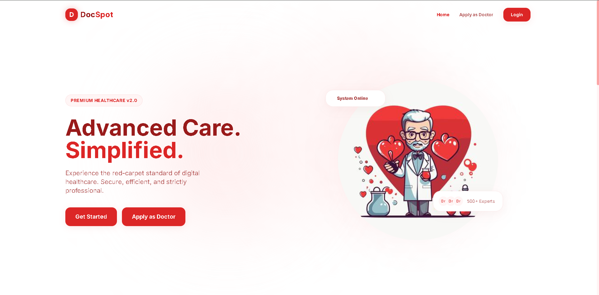
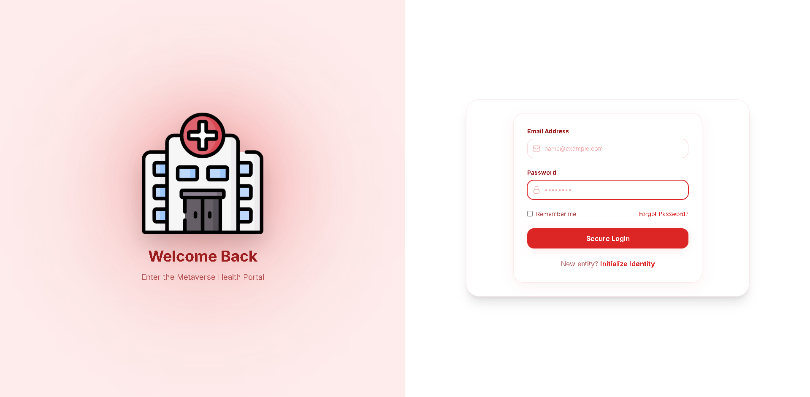
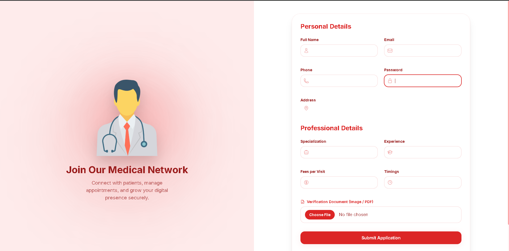
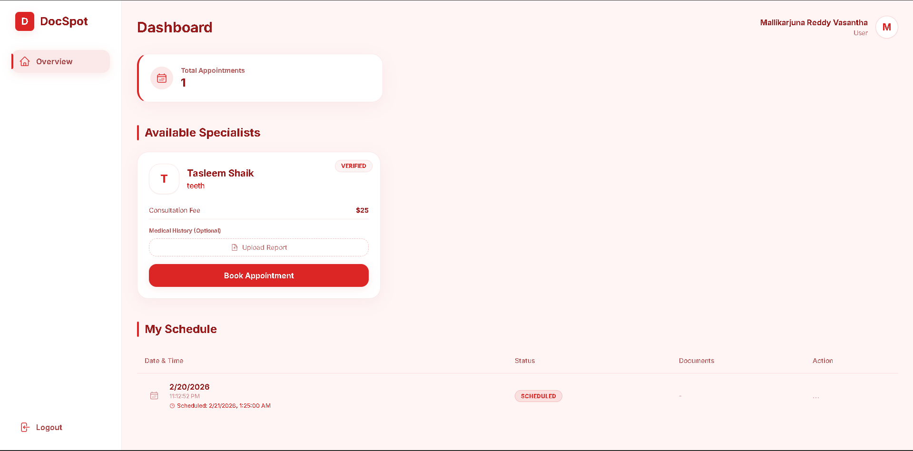
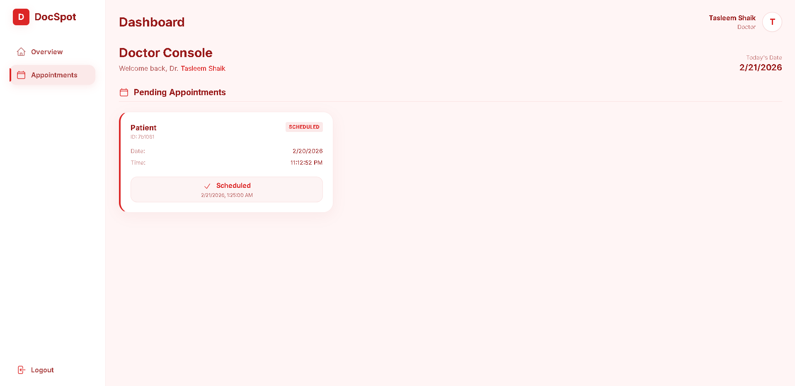
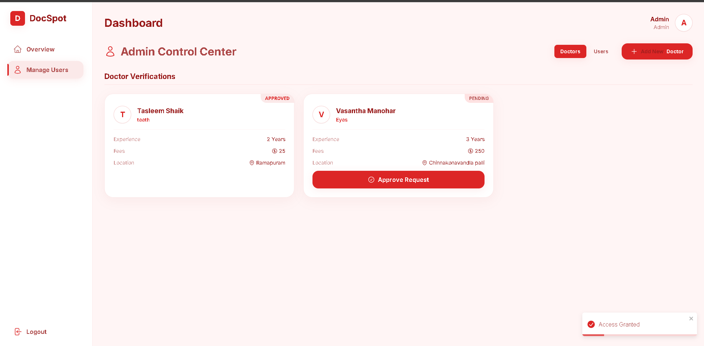

## ADMIN LOGIN:
---
 **Email:** vasanthavenkatasiva@gmail.com
 
 **Password:** Siva@262004
 
--- 

# Docspot_appointment_Booking

 DocSpot is a full-stack MERN application that enables patients to book doctor appointments seamlessly within a modern, futuristic healthcare ecosystem.

The platform features secure authentication, doctor onboarding, appointment management, and role-based dashboards — all designed with a metaverse-inspired red & white UI system.

---

## 🚀 Project Vision

DocSpot aims to provide:

- Secure and scalable appointment booking
- Doctor onboarding and verification workflow
- Admin moderation system
- Modern WebGL-inspired immersive UI
- Production-ready authentication architecture

This project demonstrates real-world full-stack engineering using industry-standard technologies.

---

## 🖼️ Screenshots

### 🏠 Landing Page (Metaverse Theme)


### 🔐 Login / Signup Interface


### 👨‍⚕️ Apply as Doctor


### 📊 User Dashboard


### 📊 Doctor Dashboard


### 📊 Admin Dashboard


---

## 🛠 Tech Stack

### Frontend
- React (Vite)
- Tailwind CSS (Red & White theme)
- Framer Motion (animations)
- React Router DOM
- React Hook Form + Zod validation
- Google OAuth Integration
- Axios
- Heroicons

### Backend
- Node.js
- Express.js
- MongoDB (Atlas)
- Mongoose
- JWT Authentication
- bcrypt (password hashing)
- Multer (file uploads)
- Role-Based Access Control (RBAC)

### Database
- MongoDB Atlas (Cloud)
- Indexed schemas
- Secure cluster configuration

---

## 🏗 Architecture Overview


Client (React Frontend)
↓
Express API Server
↓
MongoDB Atlas Cluster


Authentication Flow:


User → Login/Register → JWT Token Issued → Protected Routes


---

## 🔐 Security Features

- JWT-based authentication
- Password hashing using bcrypt
- Environment variable protection
- Role-based route access
- Google OAuth login support
- Input validation with Zod
- Secure file upload handling

---

## 📂 Project Structure

### Frontend


frontend/
├── src/
│ ├── components/
│ ├── layouts/
│ ├── pages/
│ ├── services/
│ ├── context/
│ ├── hooks/
│ └── utils/


### Backend


backend/
├── models/
├── controllers/
├── routes/
├── middleware/
├── config/
├── uploads/
├── server.js
└── .env


---

## ⚙ Environment Variables

Create a `.env` file in the backend folder:


PORT=
MONGO_URL=
JWT_SECRET=
GOOGLE_CLIENT_ID=
ADMIN_NAME=
ADMIN_EMAIL=
ADMIN_PASSWORD=
ADMIN_PHONE=


⚠ Never commit `.env` to GitHub.  
Add `.env` to `.gitignore`.

---

## 🧪 Local Development Setup

### 1️⃣ Clone Repository

```bash
git clone <your-repo-url>
cd docspot
2️⃣ Backend Setup
cd backend
npm install
npm run dev

Server runs on:

http://localhost:5000
3️⃣ Frontend Setup
cd frontend
npm install
npm run dev

Frontend runs on:

http://localhost:5173


